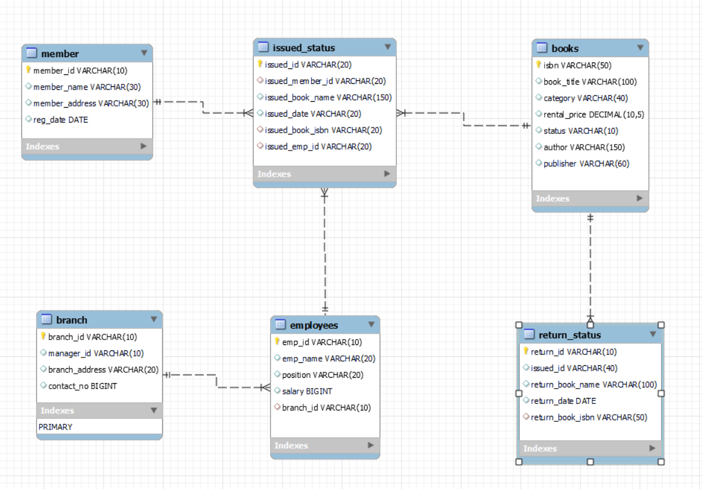

# Library Management System Project

## Overview

This project is a Library Management System developed using MySQL to efficiently manage and analyze library operations. It includes database creation, schema design, data loading, and advanced querying to handle tasks such as book tracking, branch performance analysis, and member management.

---

## Files in the Project

1. **`Creating Tables & Loading Data.sql`**  
   - Creates the **Library Management System** database.  
   - Defines the database schema by creating tables:  
     - `books`, `branch`, `employees`, `members`, `issued_status`, and `return_status`.  
   - Loads data into the tables from CSV files.

2. **`Querying Schema.sql`**  
   - Contains various queries for performing and analyzing library operations, including:  
     - **Data Analysis**: Overdue books, branch performance, and active member queries.  
     - **Data Management**: Insert, update, and delete operations.

3. **Data Files (CSV)**  
   - **`books.csv`**: Contains book records.  
   - **`branch.csv`**: Contains branch details.  
   - **`employees.csv`**: Contains employee information.  
   - **`members.csv`**: Contains library member data.  
   - **`issued_status.csv`**: Tracks book issuance.  
   - **`return_status.csv`**: Tracks returned books.

---

## Database Schema

Below is the schema diagram representing the structure of the Library Management System:



---

## Key Functionalities

- **Manage Books**: Add, update, and retrieve book records.  
- **Track Issued and Returned Books**: Monitor book issuance and returns across branches.  
- **Branch Performance Reports**: Analyze the number of books issued, returned, and total revenue by branch.  
- **Active Member Tracking**: Identify members who borrowed books in the last two months.  
- **Employee Performance**: Find employees who processed the highest number of book issues.  
- **Overdue Books**: Identify members with overdue books beyond the 30-day period.  
- **Advanced Queries**: Utilizes advanced SQL techniques like **window functions**, **CTEs (Common Table Expressions)**, **complex joins**, and **aggregate functions** for detailed insights and optimized operations.

---

## Database Schema Creation and Data Loading

### 1. Creating Database & Tables
 ```sql
-- Create the database
CREATE DATABASE Library_manage;

-- Select the database for use
USE Library_manage;

-- Drop the 'books' table if it exists and create a new one
DROP TABLE IF EXISTS books;
CREATE TABLE books(
   isbn VARCHAR(50) PRIMARY KEY,	
   book_title VARCHAR(100),	
   category VARCHAR(40),	
   rental_price DECIMAL(10,5),	
   status VARCHAR(10),	
   author VARCHAR(150),	
   publisher VARCHAR(60)
);

-- Drop the 'branch' table if it exists and create a new one
DROP TABLE IF EXISTS branch;
CREATE TABLE branch(
   branch_id VARCHAR(10) PRIMARY KEY,
   manager_id VARCHAR(10),
   branch_address VARCHAR(20),
   contact_no BIGINT
);

-- Drop the 'employees' table if it exists and create a new one
DROP TABLE IF EXISTS employees;
CREATE TABLE employees(
   emp_id VARCHAR(10) PRIMARY KEY,	
   emp_name VARCHAR(20),	
   position VARCHAR(20), 
   salary BIGINT,
   branch_id VARCHAR(10),
   FOREIGN KEY (branch_id) REFERENCES branch(branch_id)
);

-- Drop the 'member' table if it exists and create a new one
DROP TABLE IF EXISTS `member`;
CREATE TABLE `member`(
   member_id VARCHAR(10) PRIMARY KEY,
   member_name VARCHAR(30),
   member_address VARCHAR(30),
   reg_date DATE
);

-- Drop the 'issued_status' table if it exists and create a new one
DROP TABLE IF EXISTS issued_status;
CREATE TABLE issued_status(
   issued_id VARCHAR(20) PRIMARY KEY, 
   issued_member_id VARCHAR(20), 
   issued_book_name VARCHAR(150),
   issued_date VARCHAR(20),
   issued_book_isbn VARCHAR(20),
   issued_emp_id VARCHAR(20),
   FOREIGN KEY (issued_member_id) REFERENCES `member`(member_id),
   FOREIGN KEY (issued_emp_id) REFERENCES employees(emp_id),
   FOREIGN KEY (issued_book_isbn) REFERENCES books(isbn)
);

-- Drop the 'return_status' table if it exists and create a new one
DROP TABLE IF EXISTS return_status;
CREATE TABLE return_status(
   return_id VARCHAR(10) PRIMARY KEY,	
   issued_id VARCHAR(40),	
   return_book_name VARCHAR(100),
   return_date DATE, 
   return_book_isbn VARCHAR(50),
   FOREIGN KEY (return_book_isbn) REFERENCES books(isbn)
);
```

### 2. Loading Data into Created Tables
```sql
-- Show all tables in the 'Library_manage' database to confirm creation
SHOW TABLES FROM Library_manage;

-- Load data into the 'books' table from the CSV file
LOAD DATA LOCAL INFILE "D:/Projects/MySQL/6- Library Management system/Data set/books.csv"
INTO TABLE books
FIELDS TERMINATED BY ","
ENCLOSED BY '"'
LINES TERMINATED BY "\r\n"
IGNORE 1 ROWS;

-- Load data into the 'branch' table from the CSV file
LOAD DATA LOCAL INFILE "D:/Projects/MySQL/6- Library Management system/Data set/branch.csv"
INTO TABLE branch
FIELDS TERMINATED BY ","
ENCLOSED BY '"'
LINES TERMINATED BY "\r\n"
IGNORE 1 ROWS;

-- Load data into the 'employees' table from the CSV file
LOAD DATA LOCAL INFILE "D:/Projects/MySQL/6- Library Management system/Data set/employees.csv"
INTO TABLE employees
FIELDS TERMINATED BY ","
ENCLOSED BY '"'
LINES TERMINATED BY "\r\n"
IGNORE 1 ROWS;

-- Load data into the 'issued_status' table from the CSV file
LOAD DATA LOCAL INFILE "D:/Projects/MySQL/6- Library Management system/Data set/issued_status.csv"
INTO TABLE issued_status
FIELDS TERMINATED BY ","
ENCLOSED BY '"'
LINES TERMINATED BY "\r\n"
IGNORE 1 ROWS;

-- Load data into the 'return_status' table from the CSV file
LOAD DATA LOCAL INFILE "D:/Projects/MySQL/6- Library Management system/Data set/return_status.csv"
INTO TABLE return_status
FIELDS TERMINATED BY ","
ENCLOSED BY '"'
LINES TERMINATED BY "\r\n"
IGNORE 1 ROWS;

-- Load data into the 'member' table from the CSV file
LOAD DATA LOCAL INFILE "D:/Projects/MySQL/6- Library Management system/Data set/members.csv"
INTO TABLE `member`
FIELDS TERMINATED BY ","
ENCLOSED BY '"'
LINES TERMINATED BY "\r\n"
IGNORE 1 ROWS;
```

## Advanced SQL Operations

### 1.Find Employees with the Most Book Issues Processed
```sql
WITH emp_issued_books AS (
    SELECT 
        emp.emp_id,
        emp.branch_id,
        COUNT(ist.issued_id) AS num_issued_books
    FROM
        employees AS emp
    LEFT JOIN
        issued_status AS ist
    ON
        ist.issued_emp_id = emp.emp_id
    GROUP BY    
        emp.emp_id,
        emp.branch_id
)
SELECT
    *
FROM
    emp_issued_books AS emp_books
LEFT JOIN
    branch AS bch
ON
    bch.branch_id = emp_books.branch_id
ORDER BY
    num_issued_books DESC
LIMIT 3;
```

### 2. Create a Table of Active Members
```sql
CREATE TABLE active_members AS
SELECT DISTINCT
    mem.member_id
FROM
    member AS mem
INNER JOIN
    issued_status AS ist
ON
    ist.issued_member_id = mem.member_id
WHERE
    ist.issued_date >= DATE_SUB("2024-05-10", INTERVAL 2 MONTH)
ORDER BY
    1;
```

### 3. Branch Performance Report
```sql
CREATE VIEW Performance_report AS (
    SELECT
        bch.branch_id,
        bch.manager_id,
        COUNT(ist.issued_id) AS num_issued_book,
        COUNT(rst.return_id) AS num_returned_book,
        SUM(bk.rental_price) AS total_revenue
    FROM
        branch AS bch
    LEFT JOIN
        employees AS emp
    ON
        emp.branch_id = bch.branch_id
    LEFT JOIN
        issued_status AS ist
    ON
        ist.issued_emp_id = emp.emp_id
    LEFT JOIN
        books AS bk
    ON
        ist.issued_book_isbn = bk.isbn
    LEFT JOIN
        return_status AS rst
    ON
        ist.issued_id = rst.issued_id
    GROUP BY    
        branch_id, manager_id
);
```

### 4. List Members Who Registered in the Last 180 Days
```sql
SELECT
    *
FROM
    member
WHERE
    reg_date >= DATE_SUB('2024-06-01', INTERVAL 180 DAY);
```

---
## Tools Used

- **Database**: MySQL  
- **Data Files**: CSV files containing sample library data  

---

## Usage Instructions

1. Run `Creating Tables & Loading Data.sql` to create the database and load data.  
2. Execute `Querying Schema.sql` to perform operations and queries.  

---

## Contact

For any queries or suggestions, feel free to reach out:  
**Bahaa Medhat Wanas**  
- LinkedIn: [Bahaa Wanas](https://www.linkedin.com/in/bahaa-wanas-9797b923a)  
- Email: [bahaawanas427@gmail.com](mailto:bahaawanas427@gmail.com)
